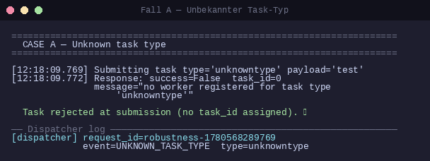
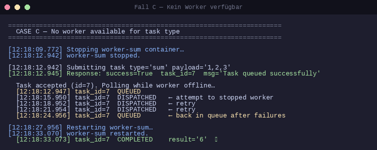
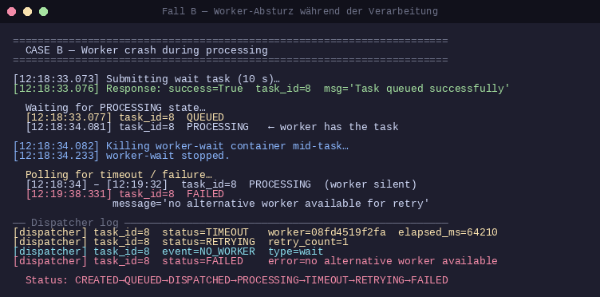

# Testprotokoll — Fehler- und Robustheitstests

**Datum:** 2026-06-04  
**System:** TaskGrid+  
**Umgebung:** Docker Compose (Podman rootless), lokale Maschine

Mindestanforderung gemäß PDF §16.2: ≥ 3 Fehlerfälle.  
Dokumentiert werden die Fälle **A**, **C** und **B**.

---

## Fall A — Unbekannter Task-Typ

### Ausgangssituation
Alle 5 Worker (reverse, sum, hash, upper, wait) sind beim Nameservice registriert und aktiv.

### Durchgeführte Aktion
Ein Task mit `type="unknowntype"` und `payload="test"` wird über `PostTask` an den Dispatcher gesendet.

### Erwartetes Verhalten
Der Dispatcher lehnt den Task sofort ab (kein Worker für diesen Typ registriert), gibt `success=false` zurück, vergibt keine `task_id`.

### Tatsächliches Verhalten
Der Dispatcher lehnt den Task ohne Zuweisung einer `task_id` ab:

```
success=False  task_id=0  message="no worker registered for task type 'unknowntype'"
```

Kein Eintrag im internen Task-Store, kein Status-Übergang. Das System läuft ohne Unterbrechung weiter.

### Dispatcher-Log
```
[dispatcher] request_id=robustness-1780568289769 event=UNKNOWN_TASK_TYPE type=unknowntype
```



### Bewertung
**Korrekt.** Der Dispatcher erkennt sofort, dass kein Worker für den Typ existiert, und gibt einen klaren Fehler zurück. Dem Client wird eine verständliche Fehlermeldung geliefert. Keine `task_id` wurde vergeben, es findet kein Status-Übergang statt.

---

## Fall C — Kein Worker für den gefragten Typ verfügbar

### Ausgangssituation
Worker `worker-sum` (`f394568ef865`, IP 10.89.0.12) ist der einzige registrierte Worker für den Typ `sum`.

### Durchgeführte Aktion
1. Container `worker-sum` wird gestoppt (`podman stop taskgrid-plus-worker-sum-1`)
2. Direkt danach wird ein Task `type="sum"`, `payload="1,2,3"` eingereicht
3. Der Task wird 15 Sekunden lang beobachtet
4. Anschließend wird `worker-sum` neu gestartet

### Erwartetes Verhalten
Der Dispatcher nimmt den Task in die Warteschlange auf (weil er zum Zeitpunkt der Einreichung noch im Nameservice-Cache sehen kann, dass ein sum-Worker registriert ist). Dispatch-Versuche schlagen fehl. Nach dem Neustart des Workers wird der Task erfolgreich bearbeitet.

### Tatsächliches Verhalten

**Einreichung (`task_id=7`):**
```
[12:18:12.945] success=True  task_id=7  message='Task queued successfully'
```

**Status während Worker offline (15 s):**
```
[12:18:12.947] task_id=7  QUEUED
[12:18:15.950] task_id=7  DISPATCHED   ← Dispatch-Versuch an gestoppten Worker
[12:18:18.952] task_id=7  DISPATCHED   ← Wiederholter Versuch
[12:18:21.954] task_id=7  DISPATCHED
[12:18:24.956] task_id=7  QUEUED       ← Zurück in die Queue nach Fehlversuchen
```

**Nach Neustart des Workers:**
```
[12:18:33.073] task_id=7  COMPLETED    result='6'
```

### Dispatcher-Logs (Auszug)
```
[dispatcher] request_id=...  task_id=7  status=CREATED  type=sum
[dispatcher] request_id=...  task_id=7  status=QUEUED  type=sum
[dispatcher] request_id=ef91e19d-...  task_id=7  status=DISPATCHED  worker=f394568ef865
[dispatcher] request_id=ef91e19d-...  task_id=7  event=WORKER_UNREACHABLE  worker=f394568ef865
    error=failed to connect to all addresses; last error: UNKNOWN: ipv4:10.89.0.12:50053:
    Failed to connect to remote host: getsockopt(SO_ERROR): No route to host
[dispatcher] request_id=...  task_id=7  status=DISPATCHED  worker=f394568ef865
[dispatcher] request_id=...  task_id=7  event=WORKER_UNREACHABLE  worker=f394568ef865  [...]
... (weitere Versuche) ...
[dispatcher] request_id=fd84f32b-...  task_id=7  status=COMPLETED  duration_ms=2
```



### Bewertung
**Weitgehend korrekt.** Der Dispatcher hält den Task in der Warteschlange und wiederholt den Dispatch-Versuch, statt sofort zu scheitern. Nach dem Neustart des Workers wird der Task automatisch zugestellt und erfolgreich abgeschlossen (`result='6'` = 1+2+3). Das System zeigt damit Selbstheilungsfähigkeit. Verbesserungspotenzial: Der Dispatcher sollte den Nameservice öfter befragen, um offline gegangene Worker früher aus dem Dispatch-Pool zu entfernen.

---

## Fall B — Worker-Absturz während der Verarbeitung

### Ausgangssituation
Worker `worker-wait` (`08fd4519f2fa`) ist der einzige registrierte Worker für den Typ `wait`. `TASK_TIMEOUT_SEC=60`.

### Durchgeführte Aktion
1. Ein Task `type="wait"`, `payload="10"` (10-Sekunden-Pause) wird eingereicht
2. Sobald der Task den Status `PROCESSING` erreicht, wird der Container `worker-wait` gestoppt
3. Das System wird bis zur Endentscheidung des Dispatchers beobachtet

### Erwartetes Verhalten
Da der Worker abstürzt, ohne ein Ergebnis zurückzugeben, wartet der Dispatcher bis `TASK_TIMEOUT_SEC` (60 s). Anschließend wird ein Retry-Versuch unternommen. Da kein alternativer `wait`-Worker verfügbar ist, wird der Task mit `FAILED` markiert. Das restliche System bleibt betriebsbereit.

### Tatsächliches Verhalten

**Einreichung und sofortiger Dispatch (`task_id=8`):**
```
[12:18:33.076] success=True  task_id=8  message='Task queued successfully'
[12:18:33.077] task_id=8  QUEUED
[12:18:34.081] task_id=8  PROCESSING   ← Worker hat Task übernommen
```

**Worker-Kill:**
```
[12:18:34.082] worker-wait gestoppt (Container podman stop)
```

**Timeout und Fehlschlag (nach ~64 s):**
```
[12:18:34.234] – [12:19:38.331] task_id=8  PROCESSING  (Worker antwortet nicht)
[12:19:38.331] task_id=8  FAILED  message='no alternative worker available for retry'
```

### Dispatcher-Logs
```
[dispatcher] request_id=...  task_id=8  status=CREATED  type=wait
[dispatcher] request_id=...  task_id=8  status=QUEUED   type=wait
[dispatcher] request_id=20927f29-...  task_id=8  status=DISPATCHED  worker=08fd4519f2fa
[dispatcher] request_id=20927f29-...  task_id=8  status=PROCESSING  worker=08fd4519f2fa
[dispatcher] request_id=c47ee937-...  task_id=8  status=TIMEOUT  worker=08fd4519f2fa  elapsed_ms=64210
[dispatcher] request_id=c47ee937-...  task_id=8  status=RETRYING  retry_count=1
[dispatcher] request_id=841f037e-...  task_id=8  event=NO_WORKER  type=wait
[dispatcher] request_id=841f037e-...  task_id=8  status=FAILED  error=no alternative worker available for retry
```

**Status-Verlauf:**
```
CREATED → QUEUED → DISPATCHED → PROCESSING → TIMEOUT → RETRYING → FAILED
```



### Bewertung
**Korrekt.** Der Dispatcher erkennt nach 64 s (≈ `TASK_TIMEOUT_SEC=60` + Puffer), dass der Worker nicht antwortet, und setzt den Status auf `TIMEOUT`. Es wird ein Retry versucht, der wegen fehlender alternativer Worker direkt zu `FAILED` führt. Die Fehlermeldung ist eindeutig. Alle anderen Worker und der Dispatcher bleiben betriebsbereit. Das Verhalten entspricht der spezifizierten Fehlerbehandlung.

---

## Gesamtbewertung

| Fall | Beschreibung | Erwartetes Verhalten eingetreten? |
|------|--------------|-----------------------------------|
| A | Unbekannter Task-Typ | Ja — sofortige Ablehnung, keine task_id ✓ |
| C | Worker offline bei Einreichung | Ja — Task bleibt in Queue, nach Neustart erledigt ✓ |
| B | Worker-Absturz während Verarbeitung | Ja — TIMEOUT → RETRY → FAILED, System läuft weiter ✓ |

Das System verhält sich in allen drei Fehlerfällen erwartungsgemäß und robust. Kein Fehler führt zum Absturz des Dispatchers oder anderer Komponenten.
